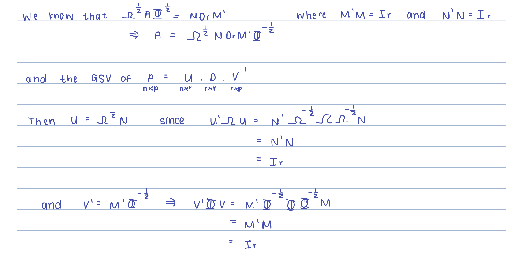

```{r setup, include=FALSE}
knitr::opts_chunk$set(echo = TRUE)

library(StatMatch)
library(MASS)
library(ggplot2)
library(gridExtra)
library(kableExtra)
library(cluster)
library(combinat)
library(maps)

melanoma <- data.frame(h = c(22,16,19,11), t = c(2,54,33,17), e = c(10,115,73,28), row.names = c("H", "S", "N", "I"))

```

## Assignment 12.1

### (a) Show that the above 𝑼, 𝑽 and $D_r$ provide the GSVD of 𝑨.

{width="516"}

### (b) Write an R function to calculate the GSVD of a rectangular matrix.

The code below uses the function for the symmetric square root matrix that was formed for Assignment 2.

```{r}
symSqrt <- function(A) {
  # Perform eigenvalue decomposition
  eigDecomp <- eigen(A)
  
  # Get the eigenvectors and eigenvalues
  eigVecs <- eigDecomp$vectors
  eigVals <- eigDecomp$values
  
  # Calculate the square root of the eigenvalues
  sqrtEigVals <- sqrt(eigVals)
  
  # Form the symmetric square root matrix
  sqrtMat <- eigVecs %*% diag(sqrtEigVals) %*% t(eigVecs)
  
  return(sqrtMat)
}

myGSVD <- function(dat=melanoma)
{
  A <- as.matrix(dat)
  Dr <- diag(apply(A, 1, sum))
  Dc <- diag(apply(A, 2, sum))
  Omega <- solve(Dr)
  Phi <- solve(Dc)
  Osqrt <- symSqrt(Omega)
  Phisqrt <- symSqrt(Phi)
  
  N <- (svd(Osqrt %*% A %*% Phisqrt))$u
  M <- (svd(Osqrt %*% A %*% Phisqrt))$v
  D <- diag(round((svd(Osqrt %*% A %*% Phisqrt))$d, 3))
  
  U <- solve(Osqrt) %*% N
  V <- solve(Phisqrt) %*% M
  
  return(list(U = round(U,4), D=D, V=round(V, 4)))
}

```

## Assignment 12.2

### Make use of the R function written in 12.1 for calculating the GSVD to obtain the correspondence analysis of C&C Table 9.1 and compute the chi-square distances between the rows as well as between the columns.

```{r}
Xnorm <- melanoma/sum(melanoma)
myGSVD(Xnorm)

# Now calculate the chisq distances between the rows and columns
Z <- as.matrix(Xnorm)

Dr <- diag(apply(Z, 1, sum))
Dc <- diag(apply(Z, 2, sum))

# get all the combinations of the rows and the columns and store them in matrices
rowcombos <- t(combn(1:4,2))
row.chisq <- numeric(nrow(rowcombos))
colcombos <- t(combn(1:3,2))
col.chisq <- numeric(nrow(colcombos))

# get the matrix with the e_i and e_j vectors in 
row.e <- diag(nrow(melanoma))
col.e <- diag(ncol(melanoma))

# calculate the chisq distances between the rows
for (i in 1:nrow(rowcombos))
{
  e.diff <- row.e[,rowcombos[i,1]]-row.e[,rowcombos[i,2]]
  dzd    <- solve(Dr)%*%Z%*%solve(Dc)%*%t(Z)%*%solve(Dr)
  row.chisq[i] <- t(e.diff) %*% (dzd)  %*% (e.diff)
  print(e.diff)
}

# calculate the chisq distances between the columns
for (j in 1:nrow(colcombos))
{
  e.diff <- col.e[,colcombos[j,1]]-col.e[,colcombos[j,2]]
  dzd    <- solve(Dc)%*%t(Z)%*%solve(Dr)%*%Z%*%solve(Dc)
  col.chisq[j] <- t(e.diff) %*% (dzd) %*% (e.diff)
  # print(e.diff)
}

# Now display the results in a neat table

rowdistances = data.frame(cbind(rowcombos,sqrt(row.chisq)))
colnames(rowdistances) <- c("row i", "row h", "Chisq distance")
coldistances = data.frame(cbind(colcombos,sqrt(col.chisq)))
colnames(coldistances) <- c("col j", "col k", "Chisq distance")

myTable1 = knitr::kable(rowdistances, caption="Chi-squared distances between the rows of the melanoma data",escape=FALSE, digits=3)
myTable1 %>%
  kable_styling(bootstrap_options = c("striped", "hover", "condensed", "responsive"))

myTable2 = knitr::kable(coldistances, caption="Chi-squared distances between the columns of the melanoma data",escape=FALSE, digits=3)
myTable2 %>%
  kable_styling(bootstrap_options = c("striped", "hover", "condensed", "responsive"))

```

## Assignment 12.3

### Carry out a correspondence analysis on C&C Table 9.1. Your R function must provide for displaying the row space and column space on separate diagrams as well as on the same diagram; the total inertia must be calculated as well as the relative contributions of the different dimensions to the total inertia.

```{r, fig.asp=1}
res <- myGSVD(Xnorm)

A <- res$U
D <- res$D
B <- res$V

U <-  solve(Dr)%*%A
V <-  solve(Dc)%*%B
UD <- U%*%D # UD_lambda
VD <- V%*%D # VD_lambda

UD
VD


# Calculate the matrices that are submitted to correspondence analysis

# AVOIDING THE TRIVIAL SOLUTION 

# DrX-1c
rowprof <- solve(Dr)%*%Z - matrix(rep(apply(Z, 2, sum), nrow(solve(Dr)%*%Z)), byrow=TRUE, nrow = nrow(solve(Dr)%*%Z))
rowprof
# DcX-1r
colprof <- solve(Dc)%*%t(Z) - matrix(rep(apply(Z, 1, sum), nrow(solve(Dc)%*%t(Z))), byrow=TRUE, nrow = nrow(solve(Dc)%*%t(Z)))
colprof
# Plot row and column space

plot(rowprof[,1:2], type= "n", main = "Row profiles")
text(rowprof[,1:2], labels = row.names(melanoma))
plot(colprof[,1:2], type = "n", main = "Column profiles")
text(colprof[,1:2], labels = colnames(melanoma))

plot(colprof[,1:2], type= "n", xlim = c(-0.15, 0.5), ylim = c(-0.25, 0.08))
text(rowprof[,1:2], labels = row.names(melanoma), col = "magenta4")
text(colprof[,1:2], labels = colnames(melanoma), col ="green4")

# INERTIA
DD <- D%*%D
I = sum(diag(DD))-1
Idim1 = DD[2,2]/I
Idim2 = DD[3,3]/I

Inertias = data.frame(c(I, Idim1*100,Idim2*100))
colnames(Inertias) <- c("Inertia and contributions")
row.names(Inertias) <- c("Total Inertia", "Contribution of dimension 1", "Contribution of dimension 2")

myTable1 = knitr::kable(Inertias, caption="The total inertia and the relative contributions of the dimensions for the melanoma data",escape=FALSE, digits=3)
myTable1 %>%
  kable_styling(bootstrap_options = c("striped", "hover", "condensed", "responsive"))

```

